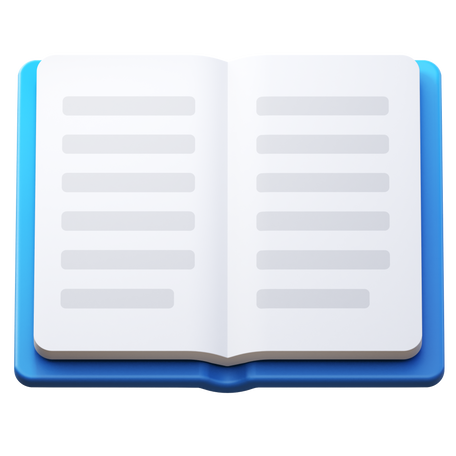

# Wervice
## Software everywhere and free

### Welcome to Wervice's code 😊
In <a href="https://github.com/Wervice/wervice.github.io">this</a> repository, you find all the Wervice frontend and backend code.

The frontend code is written in HTML and CSS. The backend uses JavaScript and PHP.
## Thanks too...
### Icons8
[Icons 8](https://icons8.com/) has lot's of amazing icons and illustrations. I use them in my apps and on my [website](https://werivce.github.io).
### Google Fonts
[Google Fonts](https://fonts.google.com) offers great fonts.
#### Montserrat
Montserrat is licenced under the [OFL (Open Font License)](https://scripts.sil.org/cms/scripts/page.php?site_id=nrsi&id=OFL) | [📂 Open](./OFL_Montserrat.txt)

#### Poppins
Poppins is licenced under the [OFL (Open Font License)](https://scripts.sil.org/cms/scripts/page.php?site_id=nrsi&id=OFL) | [📂 Open](./OFL_Poppins.txt)
